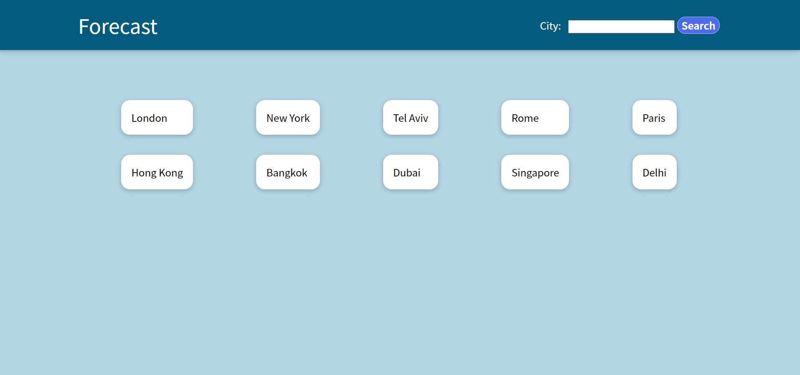
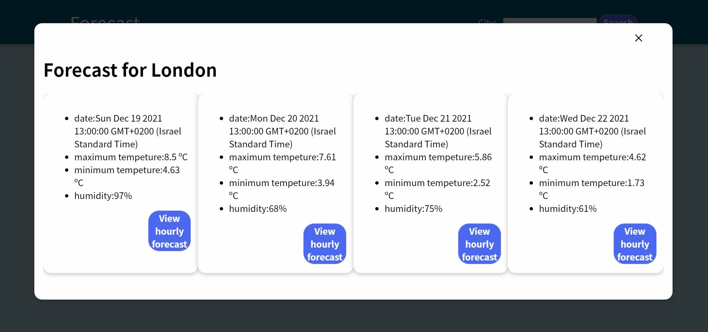

# Forecast-App

pick one of the most popular cities shortcut or search a city of your choice in the search bar and get instant forecast for next few days,
click to get hourly forecast for each day.

## Screenshots






## Installation

Install Forecast-App with npm

```bash
  cd Forecast-App
  npm install package.json
```
    
## Environment Variables

To run this project, you will need to add the following environment variables to your .env file

`REACT_APP_OW_KEY`

open weather key

Link: https://openweathermap.org/

